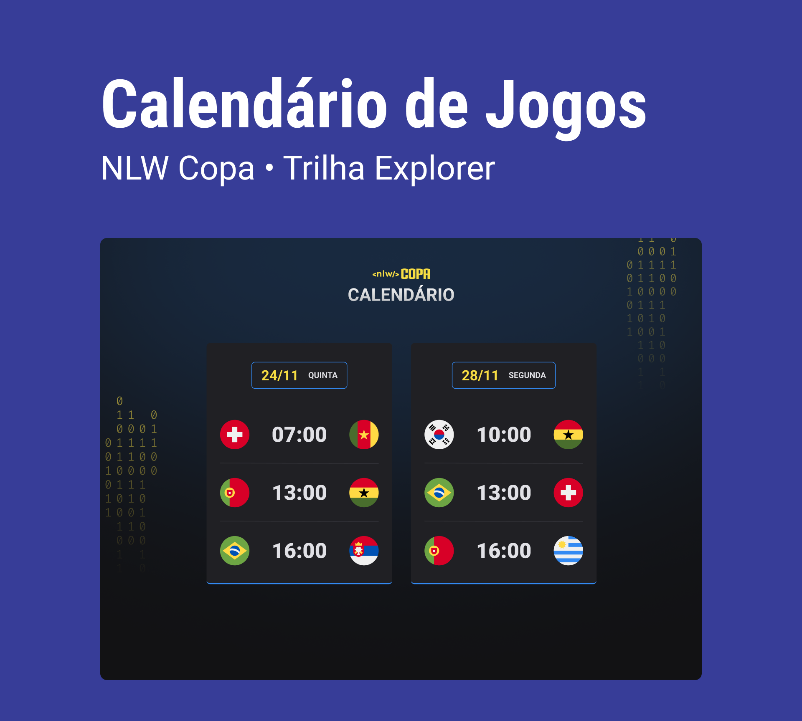

<h1 align="center">  NLW #10 Copa</h1>

vento exclusivo e gratuito, promovido pela Rocketseat para ensino de tecnologias WEB.

  <a href="#-tecnologias">Tecnologias</a>&nbsp;&nbsp;&nbsp;|&nbsp;&nbsp;&nbsp;
  <a href="#-projeto">Projeto</a>&nbsp;&nbsp;&nbsp;|&nbsp;&nbsp;&nbsp;
  <a href="#-layout">Layout</a>&nbsp;&nbsp;&nbsp;|&nbsp;&nbsp;&nbsp;
  <a href="#memo-licença">Licença</a>

  

 

  

## 🚀 Tecnologias

Esse projeto foi desenvolvido com as seguintes tecnologias:

- HTML e CSS
- JavaScript 
- Git e Github

## 💻 Projeto

O Calendario da Copa  é um projeto  que mostra os jogos da Copa de 2022.

## LINK de Asseço
(https://misacvaz.github.io/nlw-10-copa/)

## Layout
Voce pode visualizar o layout do projeto atraves de[DESSE LINK] (https://www.figma.com/file/lZN8WqoBDBBuId8NIMkROX/Calend%C3%A1rio-de-Jogos-(Community)?node-id=175%3A1815). É necessário ter conta no [Figma] (https://figma.com) para  acessá-lo.

## :Mizael Vaz

Esse projeto está sob a licença MIT.

---

Feito com ♥ by Rocketseat :wave: [Participe da nossa comunidade!](https://discord.gg/rocketseat)
